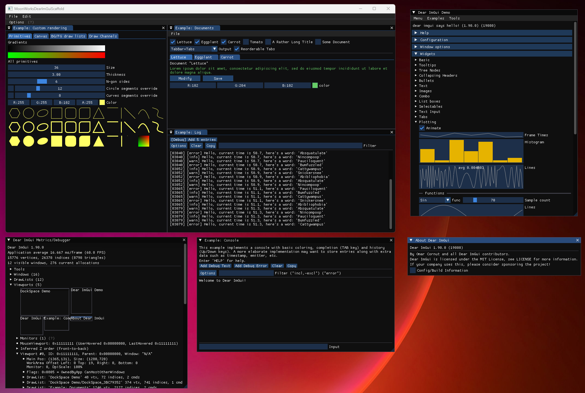

# MoonWorksDearImGuiScaffold

A starter project that you can use to get a MoonWorks + Dear ImGui application up and running. With docking and viewport support.

> NOTE: The `ImGuiController` relies on `Window.Handle` by default this is an internal getter, make it public for this to run/compile.

## Usage

Clone the repo and run `git submodule update --init --recursive` in the cloned directory.

Add your ImGui commands to the `ImGuiCommands` method.

In VSCode, press Ctrl-Shift-B to bring up the build menu.

You can also use the `dotnet` CLI interface to build or publish.

